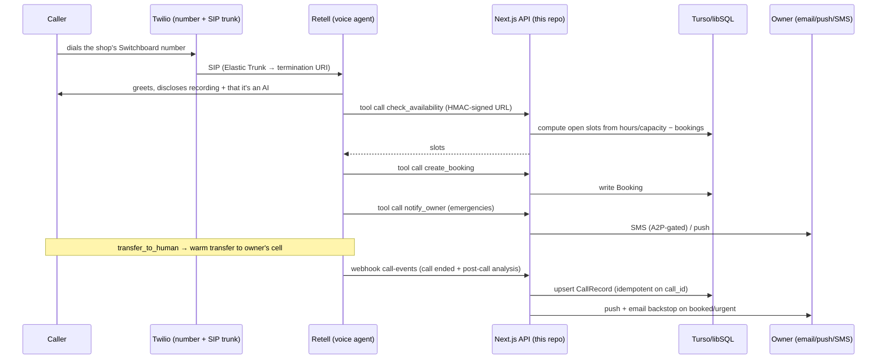

# Switchboard — Architecture & Design Review Pack

*Written for an experienced engineer doing an outside review. It is deliberately
candid: the weak parts, the stubs, and the things that have never been proven in
production are called out explicitly rather than smoothed over. If you only read
two sections, read **§11 Known stubs & debt** and **§12 What breaks at scale** —
that's where your time is worth the most.*

**No credentials, account identifiers, phone numbers, or customer data appear in
this document.** Environment variable *names* are listed because they describe
the configuration surface; no values are included.

---

## 1. What it is

Switchboard is a single-tenant-per-shop SaaS that gives a small local service
business (auto repair, HVAC, plumbing, cleaning, detailing) an AI receptionist on
a real phone number. It answers calls 24/7, books appointments against the
business's own hours/capacity, flags emergencies, and notifies the owner.

- **Buyer:** 1–5 person shops, typically not running a field-service platform.
- **Price:** $149/mo, 500 talk-minutes included, auto-scales to a higher tier.
- **Status:** feature-complete and deployed; **zero paying customers.** No stranger
  has ever completed onboarding end-to-end with real money. That is the single
  biggest unvalidated assumption in the system.

---

## 2. The call lifecycle (the important diagram)

This is 80% of understanding the system. Everything else is support for this path.



**Key seams**
- The voice provider is behind an interface (`lib/integrations/voice.ts`) with
  Retell as the implementation, plus `mock.ts` and a `vapi.ts` stub. Single-vendor
  risk is real but the seam exists.
- Agent tools are **HTTP endpoints in this app** (`app/api/agent/*`), not an
  external orchestrator. Each tool URL carries `client_id` + an HMAC token
  (`lib/integrations/agentTools.ts:14-19`). An earlier design used n8n as a broker;
  it was removed — the app is the broker now.

---

## 3. Stack, and why

| Layer | Choice | Why |
|---|---|---|
| App | **Next.js 16 (App Router), React 19, TS** | One deployable for marketing + dashboard + API + webhooks. Server Actions for mutations. |
| DB | **Prisma 6 + Turso/libSQL** (`@prisma/adapter-libsql`) | SQLite semantics, edge-ish latency, trivial ops. Same client works on a local `file:` URL and remote `libsql://` (`lib/db.ts`). |
| Auth | **better-auth** — magic link + Google (web); custom HMAC device tokens + email OTP (mobile) | No password storage anywhere. |
| Voice | **Retell** | Tools, post-call analysis, SIP import, warm transfer. |
| Telephony | **Twilio** — numbers, Elastic SIP trunk, SMS, A2P 10DLC | |
| Payments | **Stripe** (subscriptions + portal) | |
| Jobs | **Upstash QStash** (cron + delayed callbacks), Redis (rate limit) | No always-on worker; everything is an authenticated HTTP callback. |
| LLM | **Anthropic** — config prefill, prompt polish, QA enrichment | Strictly *advisory*; see §5. |
| Mobile | **Expo SDK 54 / RN 0.81** | One codebase, EAS build → TestFlight. |
| Host | **Vercel** | |

**Notable:** every vendor integration degrades to a mock when its env var is
absent (`lib/integrations/mock.ts`, and `creds()` guards inside `twilio.ts`). You
can run and exercise the whole product with zero vendor accounts. That's what
makes §13 (run it yourself) possible.

---

## 4. Repo orientation — start here

```
lib/engine.ts          # the onboarding state machine (advanceRun) — read first
lib/pipeline.ts        # the ordered step definitions
lib/steps/*.ts         # one auto-handler per provisioning step
lib/qa-rules.ts        # deterministic safety gate (can hard-block)
lib/llm.ts             # prompt assembly + LLM polish + QA enrichment
lib/versioning.ts      # AgentVersion create/approve/publish/rollback
lib/integrations/      # voice.ts (interface), retell.ts, twilio.ts, mock.ts, agentTools.ts
app/api/agent/*        # the tools the voice agent calls mid-call
app/api/jobs/*         # QStash cron callbacks
app/api/webhooks/*     # Stripe, Twilio SMS
prisma/schema.prisma   # 14 models
mobile/App.tsx         # the entire owner app (~1,140 lines, single file — see §11)
```

---

## 5. The onboarding engine

The most distinctive piece of engineering here, and the part I'd most like
critiqued.

**Model:** a linear pipeline of 14 steps (`lib/pipeline.ts:19-39`), each either
`user` (blocks, waits for input) or `auto` (runs a handler). A single
`advanceRun(runId)` (`lib/engine.ts:52`) walks from the head: run auto handlers
until it hits a `user` step or the end.

Steps, in order:
```
account → wizard → generate_config → generate_prompt → qa_review
→ provision_voice → subscribe → provision_calendar → provision_number
→ register_pipeline → test_agent → forwarding → go_live → a2p
```

**Design properties worth arguing about:**
- **Every provisioning step is idempotent.** Each checks the stored external id on
  the shop first and returns early if present, and persists ids immediately after
  creation, so a retry never double-creates (comment at `lib/steps/provision.ts:11-13`).
  Buying a phone number twice is the failure this prevents.
- **`advanceRun` is only ever called reactively** — a completion action or the
  Stripe webhook. If a signal is lost, a run sits forever. That's why
  `lib/sweep.ts` exists: a cron that reconciles subscribe-stalled runs against
  Stripe directly, re-drives `in_progress` runs (safe because idempotent), and
  pages admins on runs with no progress for N hours, deduped via the
  `FailureEvent` table used as a ledger.
- **`a2p` is deliberately last and non-blocking** — texting registration can take
  days, so it must never gate go-live.
- **`provision_voice` is intentionally *not* subscription-gated** — the owner can
  web-call their own receptionist before paying ("hear it before you buy"). Paid
  resources (number, calendar) are gated (`lib/steps/provision.ts:36-40`).

**Known sharp edge:** a number can be purchased but not routed if SIP/agent config
is missing — a "half-live" shop. It's detected and reported rather than silently
accepted (`lib/steps/provision.ts:115-124`), but the underlying ordering is still
buy-then-route rather than route-or-refund.

---

## 6. The QA gate + versioning

Every config change produces an `AgentVersion` that must pass QA before it can be
published to the live agent.

- **Deterministic rules are the backbone and are the only thing that can force a
  `no_go`** — missing city (timezone ambiguity), no escalation number, no
  emergency rules, an *exact* price (never promise a precise quote), no bookable
  service, a required booking field not collected. See `lib/qa-rules.ts` and its
  tests.
- **The LLM may only add advisory flags. It can never clear a critical
  deterministic finding** (`lib/llm.ts:221-223`, enforced at `lib/llm.ts:231`).
- Prompts are assembled from per-vertical templates with placeholder substitution
  (`lib/llm.ts:171-205`), plus a baked-in handoff section appended to every
  vertical that owners cannot remove.
- If the LLM is unavailable, `generatePrompt` returns the deterministic fill and
  the product still works. I verified this offline: the QA gate returns **GO** on a
  realistic auto-shop config with the LLM entirely disabled.

**Why this matters commercially:** reliability is the documented #1 churn driver
for AI receptionists, and no competitor markets an automated quality gate.

---

## 7. Data model (14 models, `prisma/schema.prisma`)

- **Identity:** `User`, `Session`, `Account`, `Verification` (better-auth), plus
  `DeviceToken` + `MobileAuthCode` for the mobile app.
- **Core:** `Shop` (the tenant; holds all external ids — Stripe, Twilio, Retell,
  A2P — plus config state), `OnboardingRun` + `ProvisioningStep` (the state
  machine), `AgentVersion` (immutable config+prompt snapshots).
- **Runtime:** `CallRecord` (one row per call, unique on `callId` so ingest is
  idempotent), `Booking`.
- **Ops:** `WebhookEvent` (replay/dedupe), `FailureEvent` (error ledger + alert
  dedupe), `AuditLog`.

Everything is one database, one row-set per shop, scoped by `shopId`. There is no
per-tenant database and no RLS — isolation is application-level. **Worth
challenging.**

---

## 8. Auth — three separate surfaces

1. **Web owner:** better-auth, magic link or Google. No passwords.
2. **Admin/operator:** double-gated — an `ADMIN_EMAILS` allowlist **OR** a
   `User.isAdmin` flag (`lib/session.ts`, `lib/admin.ts`). Every `/admin` page
   calls `requireAdmin()`, which redirects rather than 403s.
3. **Mobile:** email OTP → an HMAC-signed device token
   (`lib/mobileAuth.ts`, pure codec extracted to `lib/mobileToken.ts` so it's
   unit-testable without `server-only`). API routes take it as a bearer token.
4. **Machine-to-machine:** agent tool URLs carry an HMAC signature; Twilio
   webhooks verify `X-Twilio-Signature`; QStash callbacks verify their signature.

---

## 9. Background jobs (QStash cron → authenticated HTTP callbacks)

| Schedule | Job | Failure it prevents |
|---|---|---|
| `*/30 * * * *` | `onboarding-sweep` | Runs stalled by a lost webhook/crashed pass |
| daily | `usage-sweep` | A shop silently burning through plan margin |
| daily | `reminders` | Dunning / abandoned onboarding |
| daily | `reclaim-numbers` | Paying Twilio for cancelled shops' numbers |
| daily | `health-check` | Silent platform degradation |
| weekly | `weekly-digest` | Churn from invisible value (the ROI email) |

Plus delayed one-shot callbacks: `forwarding-timeout`, `a2p-poll`.

---

## 10. Unit economics, because they constrain the architecture

Voice COGS is roughly **$0.09–0.14/min** all-in (engine + LLM + telephony). A flat
$149/mo with unlimited minutes goes **negative above ~15 calls/day**.

So the plan carries `includedMinutes` (`lib/plans.ts`), and `lib/usage.ts` runs a
daily sweep that moves a shop up the tier ladder when it exceeds them. The Stripe
price swap is **gated behind `USAGE_AUTOBUMP=on`, default off** — detection and
operator alerting always run, but no real customer's bill changes automatically
until the mechanism has been observed working once.

This is the kind of thing that's cheap now and existential later, which is why
it's in the architecture rather than a spreadsheet.

---

## 11. Known stubs, debt, and unproven assumptions ⚠️

**Read this section first if you're short on time.**

1. **A2P/10DLC submission is a stub.** `submitA2P` (`lib/integrations/twilio.ts`)
   creates a customer profile, an entity, and a messaging service — then returns a
   **fabricated** campaign SID (`` `CM_${shopId}` ``), and falls back to a
   fabricated brand SID on error. It never registers a real campaign. The one real
   brand+campaign on the account was registered **by hand in the Twilio console**.
   The code's own comment says *"best-effort; validate against your Twilio account."*
   Texting is therefore not functional end-to-end via the product path.
   - Related: status polling originally checked only the **brand**, which would have
     flipped a shop to "texting on" while carriers filtered every message
     (error 30034). Now requires brand **and** verified campaign, and **fails
     closed** on anything it can't confirm.
2. **The cold path has never been completed by a real customer.** Every component
   is unit-tested and the pieces have been exercised individually, but
   signup → payment → number → forwarding → live calls has not been done by a
   stranger paying real money. A previously-fatal bug here (nothing ever called
   `markVerified`, so forwarding verification could never complete after the n8n
   removal) was found by audit, not by tests.
3. **`mobile/App.tsx` is ~1,140 lines in a single file.** No navigation library, no
   component split, no state manager. It works and ships, but it's the first thing
   that will hurt.
4. **Test coverage is shallow-but-honest:** 102 tests across 11 files, almost all
   pure functions (phone normalization, QA rules, scheduling math, SMS keywords,
   token codec). **There are no integration tests against real vendors** and no
   end-to-end test of the pipeline.
5. **No RLS / DB-level tenant isolation** — every query is application-scoped by
   `shopId`. One missing `where` clause is a cross-tenant leak.
6. **Single voice vendor in practice.** The interface exists; `vapi.ts` is a stub.
7. **Scheduling is native**, not integrated with Jobber/Housecall Pro/Tekmetric.
   Deliberate (the target customer is off-platform), but it caps the ceiling.
8. **Dev process artifact:** several Claude sessions worked this repo in parallel,
   occasionally committing onto each other's branches. If the history looks odd in
   places, that's why — not a rebase gone wrong.

---

## 12. What breaks at scale — the questions I can't answer

- **Retell concurrency:** what's the per-account concurrent-call ceiling, and what
  happens to caller #N+1? There is no queue or graceful-degradation path today.
- **Twilio number inventory:** buying/releasing per shop with a 30-day reclaim
  grace (`lib/lifecycle.ts`). At hundreds of shops this becomes real inventory
  management with real monthly cost.
- **Turso limits:** single database, all tenants. Where's the wall?
- **Vercel function timeouts:** provisioning chains several vendor calls inside one
  request. The sweep exists precisely because that sometimes doesn't finish.
- **QStash fan-out:** `sendAllDigests` and `sweepUsageOverages` iterate all live
  shops in one invocation. Fine at 10; not at 10,000.
- **Post-call webhook volume:** every call writes a `CallRecord` and may fire
  email + push + SMS synchronously in the handler.

---

## 13. Run it yourself (~10 minutes)

```bash
npm install
cp .env.example .env      # if absent, see the env names below
npx prisma migrate dev    # local file: sqlite
npm run dev
```

**With no vendor credentials, integrations fall back to mocks** and you can still
walk the wizard, exercise the QA gate, and see the dashboard. That's intentional.

Config surface (**names only — no values here**): `DATABASE_URL`,
`TURSO_AUTH_TOKEN`, `APP_URL`, `ADMIN_EMAILS`, `RETELL_API_KEY`,
`TWILIO_ACCOUNT_SID`, `TWILIO_AUTH_TOKEN`, `TWILIO_SIP_TRUNK_SID`,
`TWILIO_SIP_TERMINATION_URI`, `TWILIO_SIP_USERNAME`, `TWILIO_SIP_PASSWORD`,
`STRIPE_SECRET_KEY`, `STRIPE_PRICE_*`, `ANTHROPIC_API_KEY`, `RESEND_API_KEY`,
`QSTASH_TOKEN`, `QSTASH_*_SIGNING_KEY`, `USAGE_AUTOBUMP`, `DEMO_AGENT_*`.

Checks: `npm run typecheck` · `npm test` · `npm run build`

---

## 14. UI/UX — what to look at and the reasoning

Design feedback is wanted as much as architectural feedback.

**Public site** (`app/page.tsx`) — live at the production domain.
- **In-browser demo call before signup.** No trial, no phone, no card: click and
  talk to a receptionist. The competitive read is that "try before you buy" is now
  table stakes, but this is the lowest-friction implementation in the category.
- **Missed-call ROI calculator** in the pricing section: per-vertical average
  tickets, sliders the visitor sets themselves. Defaults are deliberately
  *conservative* (2 missed calls/day, not 5) because an inflated number loses a
  skeptical shop owner. Sourced footnote instead of hidden math.
- Price anchored against a front-desk hire, not against competitors.

**Owner wizard** (`app/app/setup`)
- **Structured fields, never a raw prompt.** Owners edit services, prices, hours,
  FAQs, emergency rules. The prompt is generated. Non-negotiable design decision:
  a shop owner should never see or tune an LLM prompt.
- Safety rules (recording disclosure, gas-smell branch, "never quote an exact
  price") are baked into templates and **cannot be removed by the owner**.

**Owner mobile app** (`mobile/App.tsx`)
- iOS-native feel: blur tab bar, large titles, haptics.
- Home screen leads with captured value ("Nx your $149 plan") — loss-framing.
- Act-on-call layer: one-tap call back / text back, call summaries + transcripts,
  a needs-attention queue with mark-handled, recording playback.

**Admin** (`/admin`, plus a gated field-sales demo page at `/admin/pitch`).

Specific UX questions in §15.

---

## 15. What I'd like your opinion on

**Architecture**
1. Is a linear 14-step state machine the right abstraction here, or is it
   over-engineered for what is essentially a provisioning script with two human
   pauses? What would you have built?
2. Application-level tenant isolation with no RLS — acceptable at this stage, or
   is that a "fix it before customer #1" issue?
3. The reactive-`advanceRun`-plus-reconciling-sweep pattern: is a sweep the right
   answer to lost signals, or is it papering over a design that should be
   event-sourced / queue-driven?
4. Provisioning buys a phone number mid-chain. How would you make that
   transactional (or make partial failure genuinely safe) across vendors that have
   no shared transaction?
5. Where would you put the first integration test, given there's budget for
   exactly one?

**Product/risk**
6. Given §11.1, would you finish the A2P automation, or drop per-shop registration
   and run everything under one platform-level campaign?
7. What's the first thing that breaks at 100 shops that I haven't listed in §12?

**UI/UX**
8. Does the ROI calculator read as credible or as a sales gimmick? Would you set
   the defaults differently?
9. The wizard hides the prompt entirely. Right call, or does the owner eventually
   need an escape hatch?
10. `mobile/App.tsx` as one file — refactor now, or is that premature given no
    users yet?

---

*Everything above reflects the codebase as of this document's commit. If something
reads as a strong claim, assume I'd rather be corrected than agreed with.*
